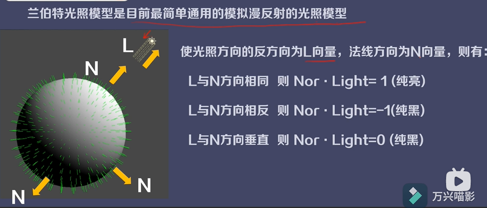

# 线性代数

## 向量

##### 向量和标量之间的计算

只有乘除计算，标量的符号控制结果向量的方向，即符号为正，方向不变，反之则方向相反，变量的数值控制结果向量的长度，即缩放操作。

##### 向量与向量之间的加减法

分量相加减

##### 点乘/内积

分量相乘的和，结果是标量

几何意义：表示两个向量之间的相似程度，结果越大，夹角越小，越相似。

大于0，同向

等与0，垂直

小于0，反向

##### 投影

ab = |a| |b| cosθ

##### 叉乘/外积

三维向量乘法运算

另外两个分量交叉相乘相减，y值取负

几何意义是得到的是垂直于这两个向量的向量，也叫法向量，

法向量模长等与|a x b| = |a| |b| sinθ

##### 向量的模长

v(x, y) 模长是：√x² + y²

##### 标准化向量

向量除以模长 Vn = V / |V|

## 矩阵

### 代数计算

### MVP矩阵

**模型空间**

**世界空间**

**视窗空间**

**裁剪空间**

**屏幕空间**

M矩阵：模型空间-世界空间

V矩阵：世界空间-视窗空间

P矩阵：视窗空间-裁剪空间

### 几何变换

## 2. 光照

### 漫反射

兰伯特光照模型

